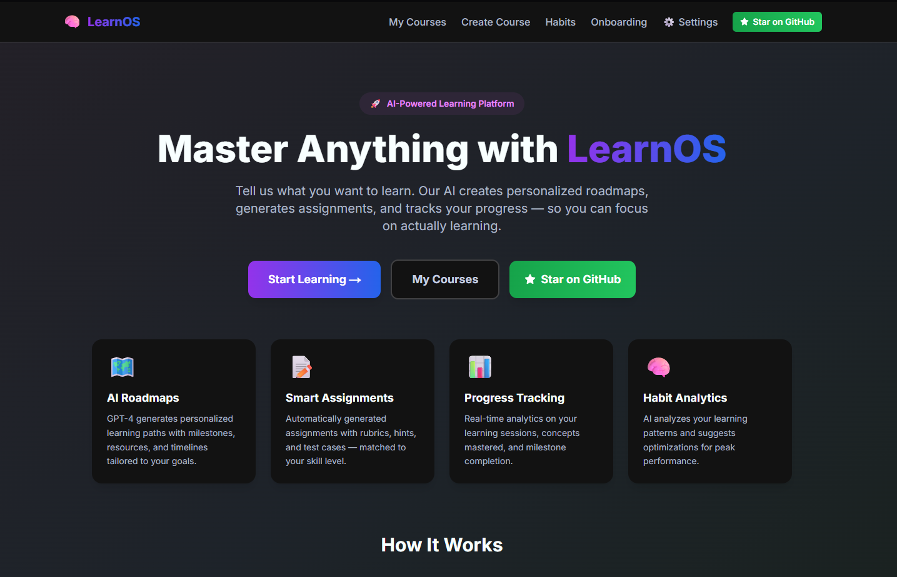
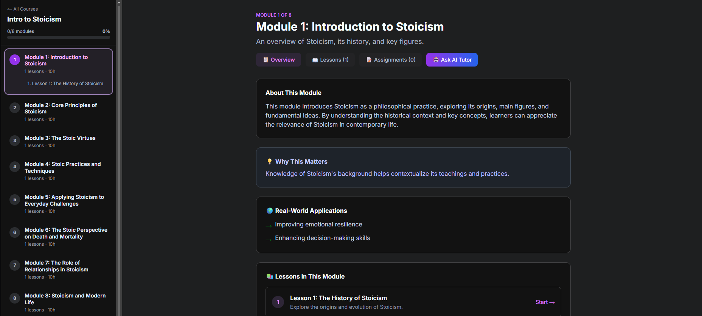
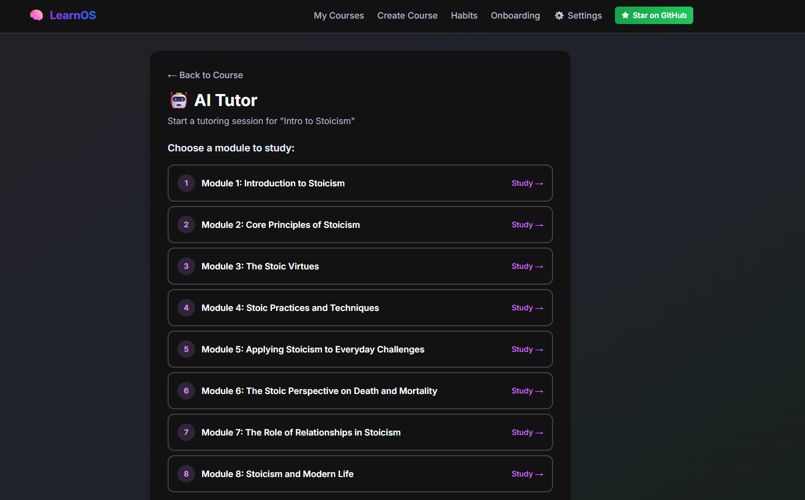

<p align="center">
  <h1 align="center">🎓 LearnOS</h1>
  <p align="center"><strong>The Open-Source AI University</strong></p>
  <p align="center">
    What if Coursera was rebuilt from scratch — with AI agents instead of pre-recorded lectures?
  </p>
</p>

<p align="center">
  <a href="https://github.com/Abelo9996/LearnOS/stargazers"></a>
  <a href="https://github.com/Abelo9996/LearnOS/network/members"></a>
  <a href="https://github.com/Abelo9996/LearnOS/blob/main/LICENSE"></a>
  <a href="https://github.com/Abelo9996/LearnOS/issues"></a>
</p>

<p align="center">
  
  
  
  
</p>

---

> **Coursera charges $49/course. Degrees cost $15,000+. Education shouldn't have a paywall.**
>
> LearnOS is building the world's first **agentic AI university** — where AI agents teach, adapt, and certify. Community-driven. Open-source. Free to learn.

---

## 📸 Screenshots

<p align="center">
  
  <br><em>🏠 Landing — AI-powered learning at a glance</em>
</p>

<p align="center">
  
  <br><em>📚 Course Modules — structured content with real-world applications</em>
</p>

<p align="center">
  
  <br><em>🧑‍🏫 AI Tutor — pick a module, start a Socratic tutoring session</em>
</p>

---

## 🌍 The Problem

Online education is broken:

- 💸 **Expensive** — Coursera, edX, and Udacity charge per course, per certificate, per degree
- 📹 **Static** — Pre-recorded lectures from 2019 teaching a 2026 world
- 🧱 **One-size-fits-all** — Same content whether you're a beginner or an expert
- 🏝️ **Isolated** — You learn alone, drop out alone (completion rates: ~5-15%)

## 🚀 The Vision

LearnOS is an **AI-native university platform** where:

| Traditional Platforms | LearnOS |
|---|---|
| Pre-recorded video lectures | AI agents that teach in real-time, adapting to *you* |
| Pay per course ($49-$99) | One subscription, unlimited everything |
| Static content that ages | Living courses powered by real-time web knowledge |
| Learn alone, drop out alone | Cohort-based learning with AI + human communities |
| Certificates that nobody trusts | Mastery-verified certificates backed by AI assessment |
| Courses created by institutions only | **GitHub of Courses** — anyone can create, fork, and improve |

### 🧬 The "GitHub of Courses" Model

Think of LearnOS as **GitHub, but for education**:

- 📚 **Create** courses using AI-assisted authoring — or let AI generate entire curricula
- 🌟 **Star & fork** courses from the community — the best rise to the top
- 🤝 **Collaborate** — improve courses together, submit PRs, suggest resources
- 📊 **Rank** by learning outcomes, not marketing budgets
- 🌐 **Share** globally — any course, any language, any level

### 🤖 Agentic Architecture

LearnOS isn't "a platform with an AI chatbot." It's a **system of specialized AI agents** that collaborate to deliver a complete university experience:

| Agent | Role |
|---|---|
| 🗺️ **Curriculum Agent** | Designs personalized learning roadmaps from your goals |
| 🧑‍🏫 **Tutor Agent** | Teaches via Socratic dialogue — adapts in real-time |
| 📝 **Assessment Agent** | Generates assignments, grades work, provides feedback |
| 🔍 **Research Agent** | Pulls from articles, papers, videos — always up-to-date |
| 📊 **Analytics Agent** | Tracks your learning patterns and optimizes your schedule |
| 🎯 **Profiling Agent** | Understands your level, style, and goals |
| 🏅 **Certification Agent** | Issues mastery-verified certificates |
| 👥 **Community Agent** | Connects you with cohorts, study groups, and mentors |

Every feature is an agent. Every agent has memory. Together, they're your personal university.

## ✨ Features (What Works Today)

- 🗺️ **AI-Generated Learning Roadmaps** — Tell it what you want to learn, get a structured path with milestones and resources
- 🧑‍🏫 **Personal AI Tutor** — Socratic tutoring that adapts to your understanding
- 📝 **Smart Assignments** — Auto-generated with rubrics, hints, test cases, and AI grading
- 📊 **Learning Analytics** — Real-time tracking of sessions, mastery, and progress
- 🧠 **Habit Intelligence** — AI analyzes your learning patterns and suggests optimizations
- 🎯 **Learner Profiling** — Onboarding that tailors everything to your level and style
- 💾 **Persistent Progress** — SQLite storage, your data survives restarts

## 🛣️ Roadmap

| Phase | Status | Description |
|---|---|---|
| **v1 – Foundation** | ✅ Done | Core platform, AI roadmaps, tutor, assignments |
| **v2 – Community** | 🔨 Building | User auth, course marketplace, starring/forking courses |
| **v3 – University** | 📋 Planned | Cohort learning, certificates, study groups, leaderboards |
| **v4 – Scale** | 🔮 Vision | Multi-language, mobile app, institutional partnerships |
| **v5 – Disruption** | 🔮 Vision | Accreditation pathways, employer verification, global reach |

**Currently focused on:** STEM courses (CS, Math, Data Science, Engineering) → expanding outward.

## 🏗️ Quick Start

### Prerequisites

- Python 3.11+
- Node.js 18+
- OpenAI API key

### 1. Clone & Backend

```bash
git clone https://github.com/Abelo9996/LearnOS.git
cd LearnOS/backend
pip install -r requirements.txt
cp .env.example .env       # Add your OPENAI_API_KEY
python main.py             # API at http://localhost:8000
```

### 2. Frontend

```bash
cd frontend
npm install
cp .env.local.example .env.local
npm run dev                # App at http://localhost:3000
```

### 3. Start Learning

1. Go to **⚙️ Settings** → enter your OpenAI API key
2. **Create a Course** → describe what you want to learn
3. Enable **AI Roadmap** → get a personalized learning path
4. Work through milestones, take assignments, track your progress

## 🏛️ Architecture

```
LearnOS/
├── backend/                  # FastAPI + SQLite
│   ├── main.py               # Entry point
│   ├── db.py                 # Persistence layer
│   ├── agents/               # AI agent modules
│   ├── services/             # OpenAI integration (41KB of agent logic)
│   ├── routers/              # REST API endpoints
│   └── models_ai.py          # Pydantic v2 schemas
├── frontend/                 # Next.js 14 + Tailwind CSS
│   ├── app/                  # App Router
│   │   ├── courses/          # Course creation & management
│   │   ├── tutor/            # AI tutoring interface
│   │   ├── habits/           # Learning analytics
│   │   └── ai-settings/      # Configuration
│   ├── components/           # Shared UI components
│   └── lib/                  # Utilities
└── docs/                     # Documentation
```

## 🤝 Contributing

LearnOS is **open-source because education should be free.** We welcome contributions of all kinds:

- 🐛 **Bug reports** — found something broken? [Open an issue](https://github.com/Abelo9996/LearnOS/issues)
- 💡 **Feature ideas** — have a vision for how learning should work? Share it
- 🔧 **Code** — pick up an issue or propose a PR
- 📚 **Courses** — create community courses (coming in v2)
- 📖 **Docs** — help us explain the vision

See [CONTRIBUTING.md](CONTRIBUTING.md) for guidelines.

## 📄 License

MIT — because knowledge should be free.

---

<p align="center">
  <strong>⭐ Star this repo if you believe education should be free and AI-native.</strong>
  <br>
  <sub>Built with conviction that the next university won't have a campus — it'll have a GitHub repo.</sub>
</p>
